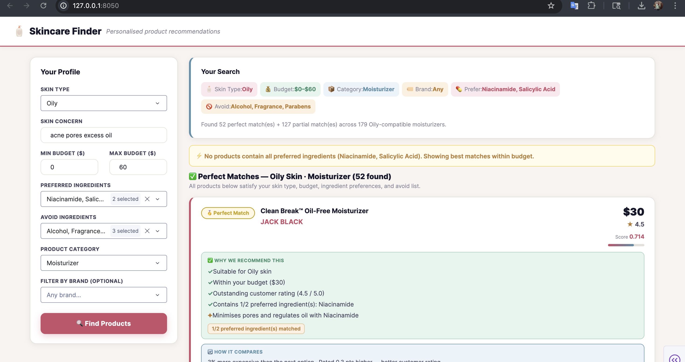
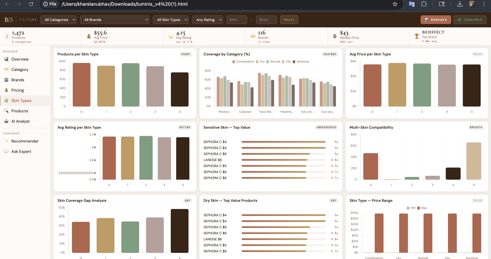

# Cosmetics Recommendation DSS and Business Intelligence System

An intelligent skincare recommendation and analytics platform that combines a Decision Support System (DSS) with a Business Intelligence System (BIS) to deliver personalized skincare recommendations and interactive cosmetic product analytics.

---

## Features

### Decision Support System (DSS)
- Personalized skincare product recommendations
- TF-IDF semantic similarity based recommendation engine
- Rule-based filtering using:
  - Skin type
  - Skin concerns
  - Ingredients
  - Budget
  - Brand preferences
- Ingredient matching and avoidance analysis
- Product scoring and ranking system
- Comparative recommendation insights

### Business Intelligence System (BIS)
- Interactive dashboard built using HTML, CSS, and JavaScript
- Product and pricing analytics
- Brand-wise and skin-type analysis
- Dynamic charts and visual analytics
- Recommendation insights and value scoring
- Comparative analysis dashboards
- Interactive filtering and exploration

---

## Technologies Used

- Python
- Dash
- Pandas
- NumPy
- Scikit-learn
- TF-IDF Vectorization
- HTML
- CSS
- JavaScript

---

## System Architecture

1. Data preprocessing and cleaning
2. TF-IDF vector embedding generation
3. Semantic similarity computation
4. Rule-based filtering
5. Product scoring and ranking
6. Interactive dashboard visualization

---

## DSS Capabilities

- Semantic ingredient matching
- Personalized recommendation generation
- Budget-aware recommendations
- Ingredient preference and avoidance handling
- Ranking and recommendation explanations
- Multi-stage filtering pipeline

---

## BIS Dashboard Insights

- Product category analytics
- Pricing distribution analysis
- Brand comparison analytics
- Skin concern trends
- Recommendation performance visualization
- Product value and coverage analysis

---

## Run Locally

### Install Dependencies

```bash
pip install dash dash-bootstrap-components pandas scikit-learn numpy
```

### Run Application

```bash
python app.py
```

Open in browser:

```bash
http://127.0.0.1:8050
```

---

## Project Structure

```bash
├── app.py
├── cosmetics_3.csv
├── dashboard/
├── assets/
├── README.md
```

---

## GitHub Repository

GitHub:  
[Cosmetics Recommendation DSS and Business Intelligence System](https://github.com/Kharel01/Cosmetics-Recommendation-DSS-and-Business-Intelligence-System?utm_source=chatgpt.com)

---

## Demo




